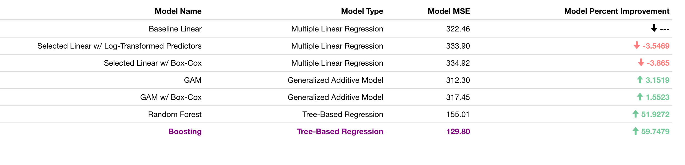
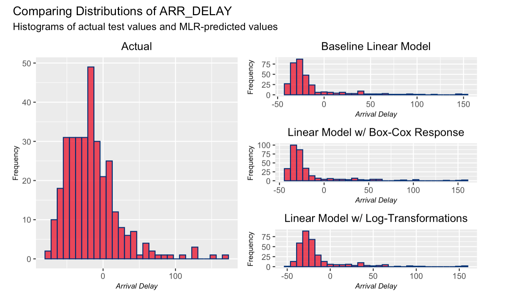
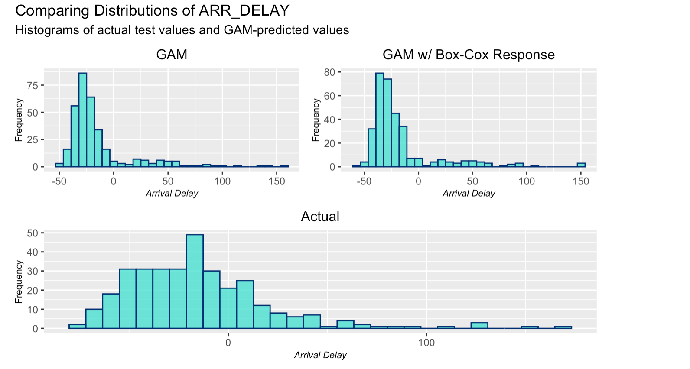
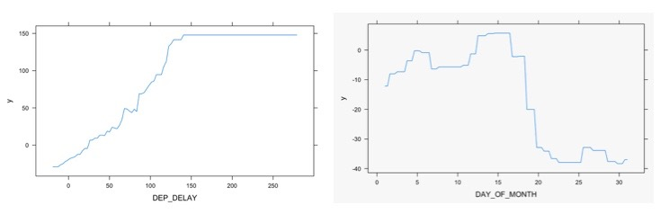
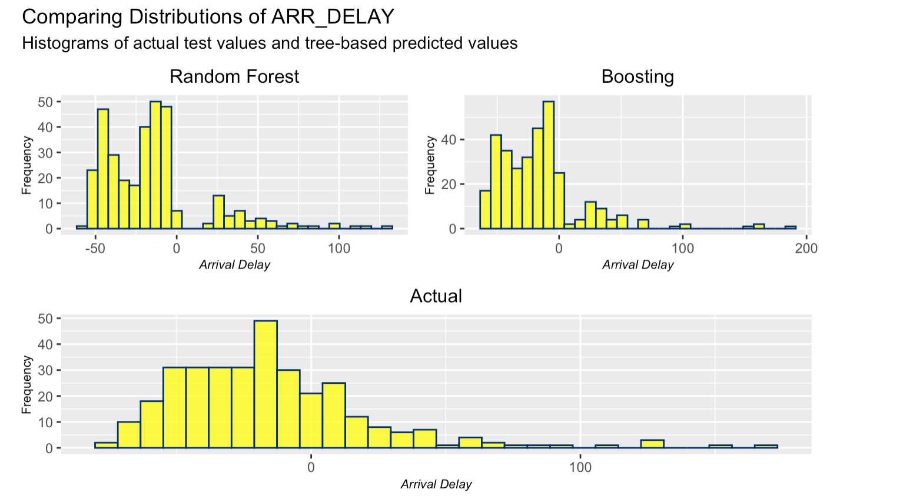

```{r setup, include=FALSE}
knitr::opts_chunk$set(echo = TRUE)
```

```{r, echo=FALSE}
library(kableExtra)
```


# Introduction

The importance of air travel in the United States is unparalleled, connecting distant parts of the country with the aviation industry's hallmarks of efficiency, safety, and reliability. This mode of transportation offers citizens to conduct business, visit loved ones, and travel for pleasure, and the number of Americans flying is widely on the climb. In fact, in 2019, U.S. airlines carried a staggering 925.5 million passengers, a record-setting number, and a healthy increase of 4.1% over the previous year. However, what is the most prominent complaint from these 925.5 million clients? Perhaps unsurprisingly, the answer is delayed flights.

Simply, flight delays bring into question a given airline's devotion to efficiency and reliability, and when such efforts are not met, disgruntled passengers are sure to become an issue. Arrival delays do not occur all too seldom, with 19.95% of flights incurring arrival delays in 2019, according to the Department of Transportation's Bureau of Statistics. A slew of research has also shown that flight delays, and the ensuing negative reactions by passengers, have consequential effects for all involved, affecting customers' airline choice, as well as their spending habits at a given airport. Thus, it is in the best interest of all parties (customers, airlines, and airport management) to ensure that the maximum number of flights are completed without delay. This goal, of course, is not realistically achievable 100% of the time. Yet a model to predict arrival delays could benefit all parties involved, offering a better understanding of the duration of any delay and allowing customers and providers to plan to optimize the situation at hand for their collective benefit.

With this thought in mind, our group has taken on the task of using machine learning methods to form a model that accurately predicts arrival delays for real-world flights. By focusing on a popular flight route within a specific interval of time, our team hopes to accurately predict arrival delays, while also keeping in mind the interpretability of available predictors, which could help in an explanation of the primary factors of flight delays. Using publicly-accessible data, the team also aims to provide findings that are readily reproducible and interpretable for all audiences, whether it be fellow passengers or airline executives.

In order to form such a model, we will use various model-building techniques, including multiple linear regression, generalized additive models, and tree-based regression. Informed by statistical measures of goodness-of-fit, variable selection, diagnostic checks, and in-depth exploratory data analysis, the project will help to develop a choice of a specific model across the viable options. Specifically by comparing relative error metrics across the different types of models, a final machine learning model will be fully explained and interpreted, weighing the relative pros and cons of each statistical decision. Future directions of the project will also be discussed, hoping to draw generalized, yet accurate, conclusions from our dataset and model to the large-scale topic of flight delays across the American aviation industry.

# Data
## Data Background & Cleaning
The data used within this final project originates from the United States Department of Transportation's Bureau of Transportation Statistics. Specifically, the team has downloaded the publicly-accessible, government data from their [Airline On-Time Performance](https://www.transtats.bts.gov/Tables.asp?DB_ID=120) database, using a subset of the data entitled "Reporting Carrier On-Time Performance." This portion of the database records all relevant data for all non-stop flights of major U.S. airlines. It is updated monthly, dating back to 1987, and includes a plethora of informative variables.

The Bureau's website allows for a direct download of the dataset for a given month and year by means of a .CSV file. For purposes of this project, the team opted to choose January 2020 as our time period of interest. Several considerations were involved in this decision, including the choice of a recent month that was not severely affected by the COVID-19 pandemic. Thus, the data collected from this month will not showcase the drastic and devastating effect that the pandemic has had on air travel traffic. We also chose to focus on a specific non-stop route within this month of data. Since four of our give group members came from either New York or California, we chose to view flights originating from New York's John F. Kennedy Airport (JFK) and arriving in California. While there were initially 10 such routes that departed from JFK and arrived in the state of California, we again narrowed our focus to those flights bringing passengers to San Francisco International Airport (SFO) and Los Angeles International Airport (LAX). This choice was made due to the fact that these two airports were the only two that had flights serviced by each carrier in the dataset, with JFK-SFO and especially JFK-LAX being among the busiest domestic air routes. This initial sorting was completed locally within Microsoft Excel and Numbers, before being uploaded to RStudio as a .CSV file.

Generally, the variables included in the dataset fall under a few holistic categories. Firstly, there are certain time-based variables, including $DAY\_OF\_WEEK$, $DAY\_OF\_MONTH$, and scheduled departure ($CRS\_DEP\_TIME$) and arrival times ($CRS\_DEP\_TIME$). Of course, route-based information is included with the $ORIGIN$ and $DEST$ variables. In our case, the origin was JFK for each observation, while the destination varied between SFO and LAX. Flight-based statistics, such as the reporting airline, departure delay, and taxi time, both prior to departure ($TAXI\_OUT$) and upon arrival ($TAXI\_IN$), offered additional information on each flight. For this  project, four U.S. mainline carriers are represented, namely American (AA), Delta (DL), Alaska Airlines (AS), and JetBlue (B6). Finally, several variables corresponded with delay times for any of five reasons: carrier delays, weather delays, National Air System delays, security delays, or late aircraft delays. Finally, as suggested by our aforementioned modeling objective, the arrival delay $ARR\_DELAY$ acts as our response variable within this project.

## Data Transformations
Within R, the data was cleaned once again. Here, errant $NA$ values were removed and the $dplyr$ package allowed for more in-depth filtering. The *mutate()* function was also used to change certain variables. One such example were the delay-based variables, which we decided to mutate into a categorical predictor that listed the type of delay that a given flight might have experienced. Changes such as these ensured that the chances of multicollinearity were reduced, as the original dataset reported delay times that, additively, could have been used to nearly exactly predict the arrival delay, thus, leaving the modeling objective with no true predictive learning potential. 

An initial exploratory data analysis also uncovered a few predictors that suggested some transformations to ensure normality for linear regression. Two such predictors were the taxi times, both prior to departure and upon arrival. The departure taxi time ($TAXI\_OUT$) reports the time from pushback from the departure gate to the time of "wheels up" upon takeoff, while the arrival taxi time ($TAXI\_OUT$) would denote the time from "wheels down" upon landing to parking at the arrival gate. A histogram of these two predictors showed fairly significant rightward skew. This result is not necessarily unexpected, as monumental ground delays or other issues might lead to several extreme values in towards the upper tails. Nonetheless, for matters of transformations, we chose to explore the usage of a log-transformation, yielding histograms that exhibited distributions that much more closely resembled a normal spread. 

It is also important to note the manner in which the response variable is reported within the original dataset. Flights arriving prior to their scheduled time yield a negative value of $ARR\_DELAY$, while flights that are late post a positive value. As such, our model will aim to predict both flight delay times, yet also the duration by which a given flight might be early.

Like the taxi times, a similar skew was found in both the predictor of departure delay and the response of arrival delay. For the response variable, we chose to undergo a Box-Cox transformation. However, this transformation proved to be somewhat challenging as the numerical response variable of $ARR\_DELAY$ includes both positive and negative values. As such, we chose to first transform the variable, increasing each value by a set amount, ensuring that the minimum value of the variable was non-negative. From here, a Box-Cox transformation was performed. 

Other interesting findings from our initial exploratory data analysis included finding empirical means and histograms of several predictors and the response. Additionally, from the days of week and days of month histograms and exploratory data analysis, we interestingly discovered that Saturday was an overall slow day in terms of numbers of flights, with a histogram of the number of flights across the days of the month of January 2020 showing the same trend. 

## Data Dictionary

Below is a comprehensive data dictionary for further reference. We have included many of the variables in the dataset, especially those variables that were central in our modeling processes.

```{r data-dict, message=FALSE, echo=FALSE, warning=FALSE}
data <- data.frame(
Variables = c("DAY_OF_MONTH",
            "DAY_OF_WEEK",
            "OP_CARRIER",
            "TYPE_DELAY",
            
            "ORIGIN",
            "CRS_DEP_TIME",
            "DEP_TIME",
            "DEP_DELAY",
            "TAXI_OUT",
            
            "DEST",
            "CRS_ARR_TIME",
            "ARR_TIME",
            "ARR_DELAY",
            "TAXI_IN"),
Type = c("numeric",
         "numeric",
         "factor",
         "factor",
         
         "factor",
         "numeric",
         "numeric",
         "numeric",
         "numeric",
         
         "factor",
         "numeric",
         "numeric",
         "numeric",
         "numeric"
         ),
Description = c("flight's day of week; Monday (1), Tuesday (2), ..., Sunday (7)",
                "flight's day of month",
                "airline providing flight; American (AA), Delta (DL), Alaska Airlines (AS), JetBlue (B6)",
                "classifaction type of delay; weather, National Air System, security, late aircraft",
                
                "flight's origin airport code; all JFK",
                "Computerized Reservation System/scheduled time of departure; reported in military time, e.g. 7:30pm as 1930",
                "flight's actual time of departure",
                "difference in flight's scheduled and actual time of departure; negative values indicate an early departure",
                "time duration from gate pushback to takeoff upon departure",
                
                "flight's destination airport code; SFO or LAX",
                "Computerized Reservation System/scheduled time of arrival",
                "flight's actual time of arrival",
                "difference in flight's scheduled and actual time of arrival; negative values indicate an early departure",
                "time duration from landing to gate parking upon arrival")
)
kable(data, "latex", booktabs = T, linesep = "", caption = "Data Dictionary") %>%
  pack_rows("General Flight Variables", 1, 4) %>%
  pack_rows("Departure-Based Variables", 5, 9) %>% 
  pack_rows("Arrival-Based Variables", 10, 14) %>% 
  kable_styling(full_width = F, latex_options = c("striped", "hold_position")) %>% 
  column_spec(1, bold = T, color = "blue") %>% 
  column_spec(3, width = "30em")
```

# Methods

## Overall Methodology

With the topic and data at hand, our project will put a particular emphasis on a model with superior predictive power over that of purely explanation. The airline industry is an especially quantitative field, maximizing their profit and efficiency with techniques such as variable pricing and schedule optimization to ensure that the most efficient combination of aircraft, flight crews, and airports fulfill the demand of all passengers. As such, accurately predicting on-time performance would be a welcomed addition to a performance- and data-driven field like aviation. In fact, an airline who might produce such an accurate model might be able to exhibit an immediate advantage over their market competitors, quickly adjusting to the dynamic needs of any potential delays.

Due to our emphasis on prediction, our modeling steps will take a structured, quantitative approach. As aforementioned, the team will focus on three main model types: multiple linear regression, generalized additive models, and tree-based regression, including random forests and boosting. Within each type of modeling, we will fit a baseline model, before experimenting with different variable transformations and interaction terms. Model selection approaches, as well as cross-validation, will also be utilized to enhance model performance and tune certain parameters. As our quantitative measure of fit, we will turn to test error metrics, especially test set mean squared error (MSE) to analyze the relative performance of each model. We ultimately hope to choose the model with the lowest MSE, while also ensuring that the model is not in any way overfit to the data at hand. While we will certainly prioritize this predictive power, we also hope to glean some intuitive, explanatory findings from our final model. 

## Multiple Linear Regression
In order to understand some of the underlying relationships in our data, we began our modeling with various iterations of multiple linear regression. In order to have a baseline model to compare our choices, we decided to fit a multiple linear regression model with the untransformed predictors and no interactions. We then performed model selection using Akaike information criterion (AIC) as the criterion. This time, only $DAY\_OF\_WEEK$ was found to be insignificant. We also tested out interactions, but surprisingly, none of our interaction effects were found to be significant through ANOVA testing. Therefore, our simple multiple linear model just included the untransformed predictors and no interaction effects.

Our next approach was to fit a model with all of our predictors, including the log-transformed predictors, $TAXI\_OUT$ and $TAXI\_IN$. We performed model selection using AIC as the criterion to get rid of some insignificant predictors, including $DAY\_OF\_WEEK$ and $CRS\_ARR\_TIME$.  We then used ANOVA testing to test various interaction terms based on our prior knowledge of these variables and found the following relationships significant in this log-transformed MLR model: airline carrier ($OP\_CARRIER$) & destination ($DEST$), time to taxi in ($log\_TAXI\_IN$) & destination ($DEST$), and time to taxi out ($log\_TAXI\_OUT$) and departure delay ($DEP\_DELAY$).

Finally, we decided to fit our simple multiple linear model with the Box-Cox transformed response variable $ARR\_DELAY$, concluding our iterations of multiple linear regression models. After finding the test MSE for each of our three models - (1) MLR without any interactions or transformations, (2) MLR with log transformed predictors ($TAXI\_IN$ and $TAXI\_OUT$), interactions, and no Box-Cox transformed response, and (3) MLR with Box-Cox transformed response, no interactions or transformations on the predictors - we were surprised to find that model (1), the simplest iteration, performed substantially better than the rest.

Moreover, upon looking at the model diagnostics for each of the three models, it appeared that most of the plots looked reasonable for a linear model fit. However, the normal QQ plots for each of the three models showed signs of deviation from normality, prompting us to pursue more cutting-edge machine learning models, such as the GAM and tree-based regression.

## Generalized Additive Modeling
After fitting three multiple linear regression models, the next step in our process was to fit general additive models (GAMs) in order to explore a more complex model. In general, fitting generalized additive models is a relatively computationally inexpensive task, while these models allow for rather easy inference and have the ability to address highly complex, nonlinear relationships. Furthermore, it allows us to explore the individual relationships between each of the predictors and the response variable. Thus, we expected our GAM models to perform well. 

We first fit a GAM with categorical variables and a smoothing spline on each numerical variable. After checking the linearity, we found that $TAXI\_IN$ may possibly be linear. We conducted an ANOVA test comparing the original GAM to a model without a smoothing spline on $TAXI\_IN$, and concluded the model with a smoothing spline on $TAXI\_IN$ was a better fit. In addition, $DAY\_OF\_WEEK$, $DEST$, and  $CRS\_ARR\_TIME$ had very high p-values, so we ran another ANOVA test excluding those variables. Based on the results of that ANOVA test, the model removing these variables was a better fit. This model included $OP\_CARRIER$, a smoothing spline on $TAXI\_IN$, a smoothing spline on $TAXI\_OUT$, a smoothing spline on $DEP\_DELAY$, a smoothing spline on $CRS\_DEP\_TIME$, and $TYPE\_DELAY$. When checking model diagnostics, it appeared that the plots looked reasonable with normally distributed residuals. 

We then fit the same GAM on the Box-Cox transformed response variable. The model diagnostics yielded reasonable plots, again with normally distributed residuals. However, this model had a higher MSE than the GAM fit on the untransformed response variable. Therefore, we concluded that the GAM on the original response variable was a better fit.

## Tree-Based Regression
Given what we know about trees, we decided to attempt two of the more cutting edge tree-based regression models: random forests and boosting.  For random forest, we used the `randomForest()` function and used the untransformed response and predictors that were considered important in our GAM model. For random forests, the one parameter to tune is `mtry`, which is the number of variables randomly sampled as candidates at each fit. The `randomForest()` function usually chooses a default of `p/3` for regression, but we decided to use cross-validation to find the most appropriate choice for `mtry`, which ended up being 2. Though somewhat computationally expensive, we decided to build 10,000 trees to inform our model. Choosing a large number of trees reduces the variance of each of the fitted trees, which is one of the benefits of the random forest approach.

The second tree-based regression approach we tried was boosting on the same untransformed response and predictor variables. Boosting is beneficial because it allows one to control the interaction depth (`interaction.depth`), number of trees (`n.trees`), and the learning rate of the model (`shrinkage`). In order to find the optimal parameters, we used the `train()` function in the `caret` package, ultimately settling on 3, 150, and 0.1, as determined through cross-validation.

# Results

## Results Overview
Carrying out our modeling approach, the table below displays the types of models fit, their respective test set MSE metrics, and their percent improvement upon the baseline model. It is quite clear that the relative predictive performance of certain models/modeling approaches seemed to improve upon each other. This improvement was especially evident when tree-based regression techniques were applied to the data. Ultimately, due to our priority of prediction and the very significant increase in predictive performance brought about by tree methods, and specifically the boosted ensemble, we opted to choose the boosted method as our final, optimal model.



## Multiple Linear Regression Results
Before explaining the optimal model and its relative strengths, it is important to note a few reasons as to why the other modeling approaches may not have been as strong in terms of prediction. Beginning with multiple linear regression, one simple explanation as to its relatively large MSE values would be that the relationship among the predictors and the response variables was not ultimately linear. The baseline linear model, in this case, included one interaction term and yielded a test MSE of 322.46. Another linear model attempt included one version that utilized log-transformed predictors as well as several interaction effects. This selected linear model with log-transformed variables, however, produced a test MSE that was just slightly worse, at 333.90. As discussed with our professor, this relative decrease in performance might not be unexpected, even though the model was fit using valid statistical reasoning, including model selection and processes to ensure that the predictors followed relatively normal distributions. This might be explained by a relative mismatch between the complexity of these transformations and the overall complexity of both the multiple linear regression approach as well as the lack of transformations utilized, in this stage, on the response variable. It is also important to briefly think about the meaning of the log-transformed variables in the context of the data. In this case, we chose to experiment by log-transforming variables such as $TAXI\_IN$ and $TAXI\_OUT$, both of which are measured in time. Thus, one might expect the "log of time" to not be especially sensical, nor explanatory, in the context of this data. Finally, the last linear model was a selected model, this time using a Box-Cox transformation on the response. This model, which found no interaction terms to be significant, again showed a very slight decrease in predictive performance with a reported MSE of 334.92. Overall, from these relatively high MSE values and a lack of improvement from any of the linear models selected, there appeared to be evidence towards non-linear trends in the data, compelling us to use non-linear methods, like GAMs and trees.

With the original, baseline multiple linear regression providing the lowest MSE, just slightly, this would be our chosen model within the scope of MLR. This model would be written as: 

$$ \widehat{ARR\_DELAY}=-24.10+0.87(DEP\_DELAY)-1.57(OP\_CARRIER(AS))+1.92(OP\_CARRIER(B6)) $$
$$ -2.30(OP\_CARRIER(DL))-1.83(DEST(SFO))-0.004(CRS\_DEP\_TIME)-0.002(CRS\_ARR\_TIME) $$
$$ +0.87(TAXI\_OUT)+0.47(TAXI\_IN)-2.22(TYPE\_DELAY(LATE\_AIRCRAFT)) $$
$$ +25.09(TYPE\_DELAY(NAS))-13.60(TYPE\_DELAY(No\ Delay)) $$

Below, we have provided histograms of the true distribution of $ARR\_DELAY$ within our test set, paired with histograms of the predicted arrival delays for each of the three linear models analyzed above. As is shown, we can see that the predictions do not seem particularly accurate, deviating significantly from the true values. This too incentivized us to explore other methods to improve our model.



## Generalized Additive Model Results

Upon realizing the lack of performance provided by multiple linear regression, our first non-linear method attempted were generalized additive models. GAMs can provide strong predictive power, with the unique ability of seeing the effect of each variable on the response. This property could be particularly useful for our modeling purposes of this data, not sacrificing any predictive power for just a bit more explanation of the variables involved. In this section of our modeling, we fit two models: one without the Box-Cox-transformed response and one with the Box-Cox-transformed response. 

Beginning with the model without the Box-Cox-transformed response, we followed a set of ANOVA tests that offered insight into which variables to include, as well as whether or not smoothing splines would optimize the model's predictive power when fit on certain quantitative predictors. In this case, our final model included four quantitative variables, each with their own smoothing splines, as well as two categorical variables. The resulting MSE from this fit was 312.30, a meaningful increase over those metrics yielded by multiple linear regression. A very similar approach was taken for our GAM model using the Box-Cox-transformed response. In fact, the same mixture of variables and splines were fit to this response variable. However, the MSE increased just slightly to 317.45, implying that that the non-transformed response model was just a slightly better fit for our predictive purposes. While these GAMs did provide more interpretable effects for each of the predictors involved, as well as better performance compared to the previously-fit linear models, the results were not especially pleasing. We hoped to receive better predictive power from these GAMs, but ultimately turned to tree-based methods to perhaps improve the performance a bit further. 

With the non-Box-Cox response GAM model providing the lowest MSE, this would be our chosen model within the scope of GAMs. This model would be written as: 

$$ \widehat{ARR\_DELAY}=1.83-1.68(OP\_CARRIER(AS))+2.49(OP\_CARRIER(B6))-3.14(OP\_CARRIER(DL)) $$
$$ -3.20(TYPE\_DELAY(LATE\_AIRCRAFT))+18.80(TYPE\_DELAY(NAS))-22.41(TYPE\_DELAY(No\ Delay)) $$
$$ +s(TAXI\_IN)+s(TAXI\_OUT)+s(DEP\_DELAY)+s(CRS\_DEP\_TIME) $$

Below, we have provided histograms of the true distribution of $ARR\_DELAY$ within our test set, paired with histograms of the predicted arrival delays for each of the two GAMs analyzed above.



## Tree-Based Regression Results

Due to the poor performance of our linear models, we decided to try tree-based regression, which usually performs relatively well when the true relationship of the data is non-linear. As mentioned in the methodology section, we decided to go with two of the more cutting-edge tree-based regression approaches: random forests and boosting. From the MSE table above, we can see that the MSE for both random forest and boosting were similar and a major improvement compared to MLR and GAM methods.  In fact, compared to the highest test MSE for MLR (333.90), boosting had a test MSE of 129.80, reflecting an improvement of about 61%. This major improvement in test MSE further confirmed to us that a linear model was not adequate for this data.

Our primary goal in terms of modeling arrival delays was to obtain a model that could predict arrival delays with high accuracy - our boosted tree model does this. However, another important feature of this boosted model is that we can get some insight into which variables are most important in predicting arrival delay. Using importance metrics, we were able to identify which variables had the greatest impact on arrival delays. Unsurprisingly, the variable $DEP\_DELAY$ was found to be the most important in predicting arrival delays. This makes sense, as these two variables are highly correlated. However, we were more interested in what other variables impacted arrival delays. The next most influential variable was the $DAY\_OF\_MONTH$, which was quite an interesting finding. Upon further reflection and looking at the data with this in mind, we believe that this can be explained by the fact that the month of January, when all of our flights took place, actually falls within the holiday season, so the beginning of January is very busy in terms of travel. This could very well be the reason why we are seeing the importance of the $DAY\_OF\_MONTH$ variable for our model. The next most important variable for our boosted model was $NAS\_DELAY$, which is the most common type of delay in our data set and covers a broad range of conditions, including extreme weather, heavy traffic volume, and air traffic control. Moreover, the variables associated with taxi time were also relatively important, which is reasonable as well. Heavy traffic on airport runways is likely to lead to delays, especially when the tarmac is backed up. 

Below you can see the partial dependence plots for the two most important variables, $DEP\_DELAY$ and $DAY\_OF\_MONTH$. These plots illustrate the marginal effect of the selected variables on the response after integrating out other variables. In the $DEP\_DELAY$ plot, we can see that as the departure delay increases, we see this value impacting the response more. Once again, this makes intuitive sense, as major departure delays do lead to major arrival delays. Moreover, for the graph of $DAY\_OF\_MONTH$ we can see clearly that the first 20 days of the month of January prove to be most important when predicting arrival delays. This confirms our hypothesis that the first couple weeks of January are usually busier in terms of holiday travel and therefore reflect somewhat of an anomaly in terms of travel. This is not something that we had considered prior to our analysis, but the fact that our model is picking up on this trend is a valuable insight that airlines and airports can take into account when scheduling flights during this busy season. Overall, our final boosted tree model is very promising in that it performs very well in terms of prediction and also is very interpretable in terms of which variables are most impactful when predicting arrival delays.



Below, we have provided histograms of the true distribution of $ARR\_DELAY$ within our test set, paired with histograms of the predicted arrival delays for each of the two tree-based methods analyzed above, with random forest and boosting.



# Conclusions & Future Directions

All in all, our final, optimal model for predicting arrival delay times from flights originating from JFK and traveling to SFO and LAX would be a tree-based regression, with boosting. Throughout our explained modeling techniques and procedures, we have shown that this model provided a drastic increase in predictive performance compared to all other models. Due to our, and the industry's, emphasis on quantitative prediction, this model appears to be the best solution to the problem at hand. However, the final strength of this project's modeling techniques was ultimately shown through our step-based procedure that exposed certain weaknesses and strengths of the intermediary models. Thus, we hope to have shown that this progressive technique of using several types of models, with several iterations, offers the most holistic approach to modeling such a dataset.

As with any data-driven analysis, there exists a number of available directions in which our project can be improved and built upon in future work. Firstly, it is important to realize the number of people and organizations that could greatly benefit from a model as developed in this project. The aviation industry is made up of several groups, with the main ones of course being the clientele (passengers), the airlines, and the city- or municipally-run airports. Passengers could greatly benefit by carefully choosing flights that might avoid certain systematic delays, while airlines could more quickly react to delays in anticipation of their actual occurrences. This could allow for a better movement of resources by the airlines and their sub-contractors (flight caterers, fueling, baggage teams, etc.) to ensure that any delayed flight is efficiently dealt with, minimizing the effect of a given delay on the next flight on the same aircraft. Finally, airports themselves could benefit from a predictive model, improving air traffic control flows and patterns or perhaps even capitalizing on certain delays with more seamless boarding processes, leading to greater customer satisfaction. Overall, while sounding perhaps circular or surprising, predicting delay times might be the first step in maximizing the industry's efficiency when delays do, in fact, occur. Importantly, such an improvement would be an improvement for all parties involved in U.S. aviation.

Finally, one acknowledged shortcoming of our project would be extrapolation and overall generalizability. While each step in this project and the provided code is statistically justified and logically sound, the team did focus on a very specific portion of the massive data repository maintained by the USDOT's Bureau of Transportation Statistics. It is important to note that we focused on one month, of one year, with only flights originating from only one airport to just two destinations. As such, the effects found and analyzed throughout the project, while accurate for this time period and route, represent a very small portion of the total air traffic found over the United States of America. We do believe, however, that, while the specific final models of the project will likely not immediately provide the same predictive power when applied to other dates or routes, our modeling *procedure* would be highly beneficial when applied more generally. Additionally, we are fairly confident that the final model type of tree-based regression, with boosting, would provide the strongest prediction, while certain variables and parameters would need to be tuned for different datasets. We would hope that the procedures used within this project can be expanded upon in the future by other teams, as the impact of such a model would only be magnified with such an expansion. This generalization can be applied to other routes and time periods, with a specific interest being the effect that the COVID-19 pandemic has had on aviation arrival delays. Due to the reproducibility of this project, we believe that this goal can be adequately achieved, bringing us all closer to a more reliable, efficient, and enjoyable experience when flying 30,000 feet above our great country.

## Notes & References

- Data Source: [Reporting Carrier On-Time Performance](https://www.transtats.bts.gov/Fields.asp), U.S. Department of Transportation: Bureau of Transportation Statistics 

- Additional Research: ["Preliminary Estimated Full Year 2019 and December 2019 U.S. Airline Traffic Data"](https://www.bts.gov/newsroom/preliminary-estimated-full-year-2019-and-december-2019-us-airline-traffic-data), U.S. Department of Transportation: Bureau of Transportation Statistics 

